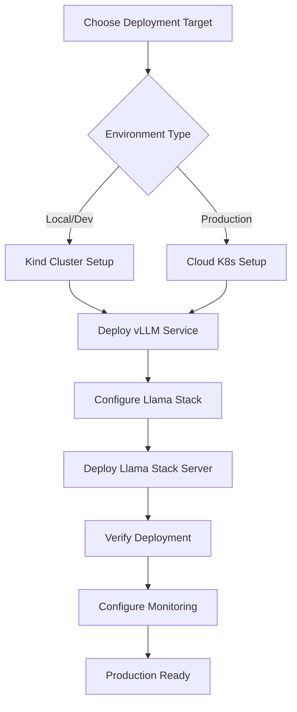

import Tabs from '@theme/Tabs';
import TabItem from '@theme/TabItem';

# Deploying Llama Stack

This section provides comprehensive guides for deploying Llama Stack in production environments, focusing on scalable, reliable deployments suitable for enterprise use.

## Deployment Options

Llama Stack can be deployed in various environments depending on your requirements:

<Tabs>
<TabItem value="kubernetes" label="Kubernetes">

**Container Orchestration**
- Deploy on Kubernetes clusters (local, cloud, or on-premises)
- Supports both local development (Kind) and production (EKS, GKE, AKS)
- Includes horizontal scaling and high availability
- Integrated with vLLM for efficient model serving

**Use Cases:**
- Production environments requiring scalability
- Multi-tenant deployments
- CI/CD integration
- Auto-scaling based on demand

[**→ Kubernetes Deployment Guide**](./kubernetes)

</TabItem>
<TabItem value="cloud" label="Cloud Native">

**Managed Cloud Services**
- AWS EKS with automated setup scripts
- Integration with cloud storage and networking
- OAuth authentication support
- Load balancing and auto-scaling

**Use Cases:**
- Enterprise cloud deployments
- Teams requiring managed infrastructure
- Applications with variable traffic patterns
- Integration with existing cloud services

[**→ Cloud Deployment Details**](./kubernetes#deploying-llama-stack-server-in-aws-eks)

</TabItem>
<TabItem value="local" label="Local Development">

**Development & Testing**
- Local Kind clusters for testing
- Docker Compose setups
- Single-node deployments
- Quick prototyping environments

**Use Cases:**
- Development and testing
- Learning and experimentation
- CI/CD testing pipelines
- Resource-constrained environments

[**→ Local Setup Guide**](./kubernetes#prerequisites)

</TabItem>
</Tabs>

## Architecture Considerations

### High Availability
- **Load Balancing**: Distribute traffic across multiple Llama Stack instances
- **Failover**: Automatic failover for model serving components
- **Health Checks**: Kubernetes liveness and readiness probes
- **Data Persistence**: Persistent volumes for model storage and application data

### Scalability
- **Horizontal Scaling**: Scale Llama Stack servers based on demand
- **Model Serving**: Separate model inference from application logic
- **Resource Management**: CPU and memory limits for predictable performance
- **Auto-scaling**: Kubernetes Horizontal Pod Autoscaler (HPA) support

### Security
- **Network Policies**: Secure inter-service communication
- **Secrets Management**: Secure handling of API keys and tokens
- **RBAC**: Role-based access control for Kubernetes resources
- **Authentication**: OAuth integration for user management

## Getting Started

### Quick Start Checklist

1. **✅ Choose Your Environment**
   - Local development: Kind cluster
   - Production: AWS EKS, GKE, or AKS
   - Hybrid: On-premises Kubernetes

2. **✅ Prepare Prerequisites**
   - Kubernetes cluster access
   - Container registry access
   - Model access tokens (Hugging Face)
   - Storage provisioning

3. **✅ Configure Resources**
   - Persistent volumes for model storage
   - Secrets for API tokens
   - Network policies and services
   - Ingress controllers (if needed)

4. **✅ Deploy Components**
   - Model serving infrastructure (vLLM)
   - Llama Stack server
   - Supporting services
   - Monitoring and logging

### Recommended Flow

## Best Practices

### 🏗️ **Infrastructure**
- Use persistent volumes for model storage to avoid re-downloading
- Separate model serving from application logic for better scaling
- Implement proper resource limits and requests
- Use namespaces to organize related resources

### 🔒 **Security**
- Store sensitive data (API keys, tokens) in Kubernetes secrets
- Use network policies to restrict inter-pod communication
- Implement proper RBAC for cluster access
- Regular security updates for base images

### 📊 **Monitoring**
- Deploy logging aggregation (ELK stack, Fluentd)
- Set up metrics collection (Prometheus, Grafana)
- Configure alerts for system health
- Monitor resource utilization and performance

### 🚀 **Performance**
- Use appropriate node types for GPU/CPU workloads
- Configure resource requests and limits
- Implement caching strategies
- Monitor and optimize model loading times

## Troubleshooting

### Common Issues

**Pod Startup Failures**
- Check resource limits and node capacity
- Verify secret and configmap references
- Review persistent volume claims
- Check image pull policies and registry access

**Model Loading Issues**
- Verify Hugging Face token permissions
- Check persistent volume size and availability
- Monitor download progress in pod logs
- Ensure network connectivity to model repositories

**Service Connectivity**
- Verify service selectors and port configurations
- Check network policies and ingress rules
- Test internal DNS resolution
- Validate load balancer configurations

## Related Resources

- **[Kubernetes Deployment Guide](./kubernetes)** - Detailed deployment instructions
- **[Distributions](/docs/distributions)** - Understanding Llama Stack distributions
- **[Configuration](/docs/distributions/configuration)** - Server configuration options
- **[Building Applications](/docs/building-applications)** - Application development guides
